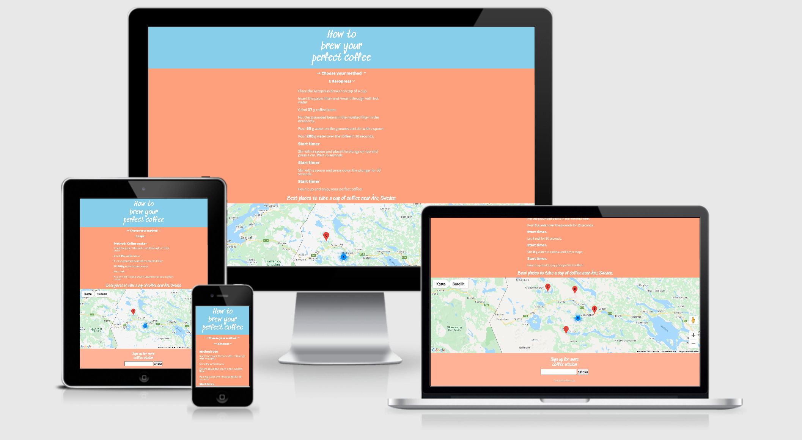
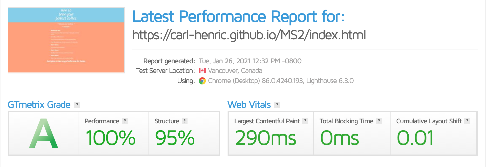

# Make your perfect coffee guide / MS2
## This simple (but yet so important) webpage is made as a source for everyone who want´s to learn how to brew the perfect cup of coffee. The idea came from when I did´nt find any simple guides on the internet how to start brewing with a V60 pour over brewer, so I decided to build one by myself and hope there is someone who will enjoy it. 
----
## UX
## Project Goals
To help people start brewing manualy with a simple guide that is made for mobiles. A guide that easaly helps the user to dose correclty everytime. 

## User Goals 
* Learn how to brew coffe with three different techniques with great success. 
* Get in touch with the devolper 

## User stories 
* As a user, I want it very easy for me to understand how I use the guide. 
* As a user, I want it to be clearly what kind of method I am about to brew and how much. 
* As a user, I want the steps to be easy to follow with clearly instructions. 

## Site Owner Goals
* As a site owner, I want the user to feel safe on how to use the site. 
* As a site owner, I want the user to feel inspired to test brew manualy. 
* As a site owner, I want the user to comeback and use the guide like a routin when brewing coffee manualy. 

## User Requirements and Expectations. 
### User Requirements
* Understand the guide.
* Understand the steps for each brewing technique. 

### User Expectations 
* Get perfect coffee when following the guide.
* Fully functional timers and correct weight for both coffee, blooming and water. 
---
## Design Choices
Main main focus with this page has been that it should work perfect on mobile devices and the second is that I want the first impression to feel easly, almost playful.
Coffee pages usally uses natural colors with close-up pictures of coffee beans or pictures of baristas taking it very seriously. 
I wanted this page to feel relaxed and welcoming, without feeling unserious. 

### Fonts
When it comes to choose fonts there was two major things that was important, readability on mobile devices and playfulness. 
If the fonts where to strict the overall feeling would be too boring because the lack of pictures and other element. There is almost
only text in the guide so it needed to be something that booth where easy to read on small screens and playfull. 
The solution was to have two totally different fonts, one for heading and one for paragraph and smaller headings. 

Google fonts have been used for both fonts because is works seamless on all devices and are very reliable. 

All fonts is white because of the clear contrast to the backgrounds. 

#### Headings 
For the header title and H3 in the footer, [Sedgwick Ave](https://fonts.google.com/specimen/Sedgwick+Ave?preview.text=Coffee%20guide%20&preview.text_type=custom&category=Handwriting&sidebar.open=true&selection.family=Sedgwick+Ave#standard-styles) has been used. It is playfull and works well on smaller screens when the font-size is pretty big, like headings. 
Under the process I have been used Google Fonts preview mode to see what kind of font that will work. 

#### Paragraph 
For the main content, the guide, [Source Sans Pro](https://fonts.google.com/specimen/Source+Sans+Pro?category=Sans+Serif&preview.text=How%20to%20brew%20your%20perfect%20coffee&preview.text_type=custom&selection.family=Source+Sans+Pro:wght@400;900&sidebar.open=true&query=source+sans#glyphs) has been used. 
Its perfect for content because of its simplicity and clean lines. It also looks great on small screens even when the font-weight is low. 

### Icons 
[Fontawesome](https://fontawesome.com/) is the source fo the Icons via their CDN. Looks great and are very reliable on all devices. 

### Colours
As mentioned earlier, in the Design choices segment the challenge has been to combine both playfulness and credibility. 
The biggest design element on this page is the colours of Header, body and footer. When a stricter font i used for the guide, the colours needed to be contrasted with easiness. 
The decision landed in two tones of salmon/apricot #ffb294 and lightsalmon for body and footer. 
The Header is skyblue as a contrast to the warm pastell and looks great on all devices. 

---
## Wireframes 
When the process started with how to communicate a simple guide that probably 90% of the users using a mobile with, the challenge was to create something very simple without being booring but also a clear guide without risk for misunderstanding. 
I prioritized user experience before state of the art functions. To set my ideas to a visual sketch with clean functions, I choosed to made it in [Balsamiq Wireframes](https://balsamiq.com/). 

* Wireframe for [Mobile](/assets/wireframes/mobile.png)
* Wireframe for [Desktop](/assets/wireframes/desktop.png)

---
## Technologies used 
The page has been built in three coding languages: HTML, CSS and Javascript. 
* **HTM**L: For structure and content. 
* **CSS**: For styling HTML. 
* **Javascript**: Får functions and interactivity.  

### Tools & Libraries 
* **Git**: for version control 
* **Git hub**: for storing this project in a safe way. 
* **Font awesome**: for icons. 
* **Google fonts**: for easy to use fonts. 
* **Google devtools**: for troubleshooting and responsive check. 
* **Beutifier**: to polish the code

----
## Features
### Features that have been implemented 
* When choosing amount of cups, coffee grams, bloom grams and amount of water will bi updated based on your choice. 
* When choosing method, coffee, bloom and water changes depending on brewing method. 
* Google maps Api for see the best places to drink your coffee near Åre, Sweden. 
* Newsletter form.
* Mailto link on "Built by: Carl-Henric Grip"

### Features that will be implemented in the future
* Ability to change type of bean for each brewing method. 
* Ability to change the amount of coffee from your taste, and save your preset. 

---
## Testing 
### Validators

#### Html: 
For testing the HTML code, [W3 validator](https://validator.w3.org/nu/) have been used. All pages passed the test without errors but with one warning regarding the lack of headings in Cup-selector section. 
Thats because the heading for the amount of cups is the first option in the rolldown. 

#### CSS:
For testing CSS, [W3 CSS validator](https://jigsaw.w3.org/css-validator/) have been used with great success and without any errors or warnings. 

#### Javascript
For testing Javascript, [JSHint](https://jshint.com/) have been used. No error but with warning _"Did you mean to return a conditional instead of an assignment?"_. 
Accordning to [JSLint Error Explanations](http://linterrors.com/js/did-you-mean-to-return-a-conditional) the Error dosen´t affect the functionality but may be confusing for others. 
In this case I can accept the warning without fixing it. 

### Speed
For testing how fast the page is loading, [Gt Metrix](https://gtmetrix.com/) have been used. The result was A with 100% in performance and 95% Structure which I am happy with. 

### User stories
 #### __As a user, I want it very easy for me to understand how I use the guide__
 I have let other people test the guide on different advices to see if they understand how to use it and there hasen´t been any problems with it at all. Initially the method selector where a horizontal menu but after a couple of tests it took some time for the users to find the menu so I changed to a dropdown menu instead. 

#### As a user, I want it to be clearly what kind of method I am about to brew and how much. 
As mentioned in the user story above, the method menu was changed to a more UX-friendly solution with dropdown. 
Both method and Amount are very easy to see and use on the page, both from desktop and mobiles. 

#### As a user, I want the steps to be easy to follow with clearly instructions. 
The instructions are very educational and easy to follow with clear text and timers. 

---

### Features
| Feature        | Expected           | Testing  | Result  |
| ------------- |-------------| -----|-----|
| **Values**    | Current values based on selection | Tested to change values on both desktop (safari, chrome and Firefox) and mobiles |Works as expected |
| **Google maps**      | To see cluster markers on the correct places     |   Tested the map on different devices and screens | Works as expected |
| **Newsletter** | To recieve the submitted address.    |    Tested to sign up for the newsletter | Works as expected|
| **Mailto link** | Opens a new mail-window.     |    Tested to click the link in different screens and devices. | Works as expected. |

### Responsivness
The testing of the responsivness have been an ungoing process among the project. Every time changes has been done, its been inspected in Google devolper tools with different types of mobile screen sizes.
The guide have been built for mobile first so the responsivness has been a central part of the devolpment. 

For more screens to test, [Lambda test](https://app.lambdatest.com/) has been used. All accessible screens looks good. 

### Bugs
There has been some bugs with Google maps Api to show during the devolpment, with the application restrictions. 

---
## Deployment
The page is made with Git in combination with Git Hub. For more control of the process I have been commited more often in this project. 

1. Got to [Github](https://github.com/) and sign in with the form in upper right corner.
2. Or, go direct to https://github.com/Carl-Henric/MS2. 
3. In the Tab menu above the content area, click on settings. 
4. Scroll down to the section called Pages, right under the Archives section. 
5. Choose Master Branch from the source dropdown menu.
6. Click to confirm my selection.
7. Now the page is published, see link in blue under the heading ### Git Hub Pages.  

### How to run this project locally (How to clone this project from Github:)
1. Go to https://github.com/Carl-Henric/MS2 
2. Click the “Code”-button with the down arrow and copy the http-address.
3. Open Gitpod and open a new terminal, then click terminal, and new terminal.
4. In the terminal, paste the code and press enter.
5. Voila!

---

## Credits
Code inspiration and help:
* [Calling a function with a dropdown menu](https://stackoverflow.com/questions/43671008/html-javascript-calling-a-function-with-drop-down-options)
* [Problems with loading scripts](https://stackoverflow.com/questions/26107125/cannot-read-property-addeventlistener-of-null) 
* [Timer fucntion](https://stackoverflow.com/questions/54637148/how-to-add-onclick-event-to-start-timer)
* Google Maps API from Code intitue Google maps course. 
